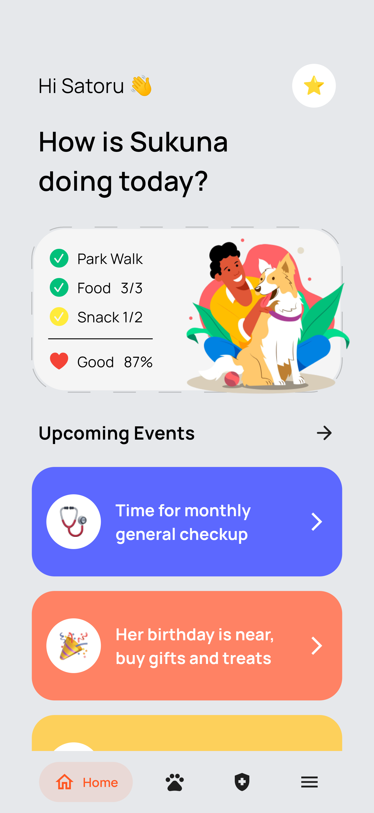
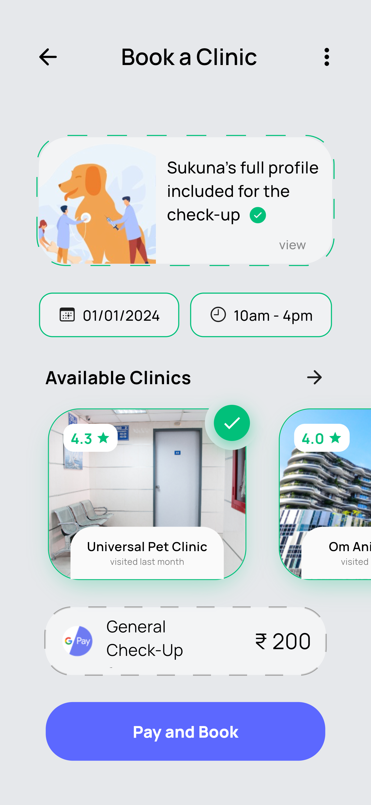

# Pet Pioneer App Design

## Description
Pet Pioneer is a visually stunning Flutter app designed to cater to the needs of pet owners. This project showcases the UI/UX design of two key pages: the Home Screen and the Clinic Card Screen. These designs demonstrate an intuitive and user-friendly interface, perfect for a pet-related application.

## Screenshots

*Home Screen showcasing the user greeting and pet status overview.*

*Clinic Card Screen displaying detailed information about pet clinic visits.*

## UI Design
The UI for Pet Pioneer was meticulously crafted using Figma, ensuring a sleek and modern aesthetic that appeals to pet owners. You can view the detailed UI design resources here: [Figma Design Resources](https://www.figma.com/community/file/923771098019558112)

## Key Features
- **Home Screen**: A welcoming interface displaying the pet's current status and upcoming events.
- **Clinic Card Screen**: Provides detailed information about the pet’s clinic visits and check-ups, complete with engaging visuals.
- **Responsive Design**: Optimized for both large and small screens, ensuring a seamless user experience.

## Technical Overview
This project is implemented using Flutter, demonstrating the use of:
- Custom widgets like `PetStatusCard` and `EventButton`.
- External packages such as `dotted_border` for decorative elements.
- Effective use of `Stack`, `Positioned`, and other layout widgets in Flutter.

